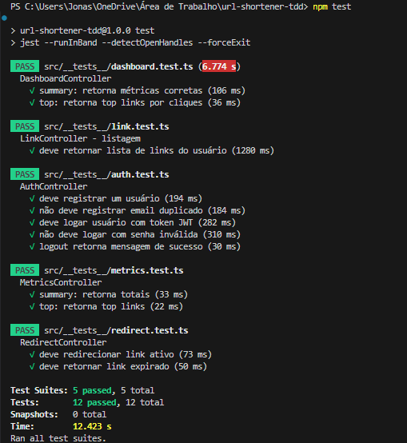
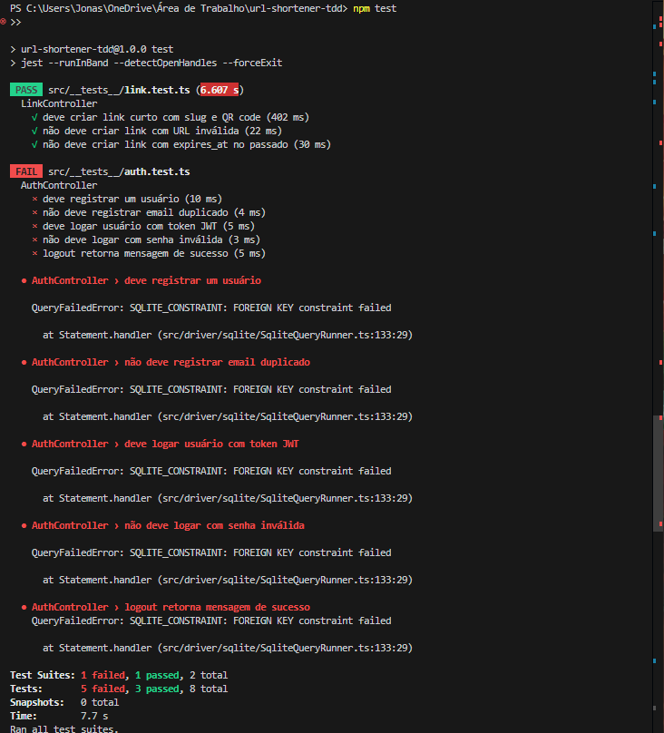
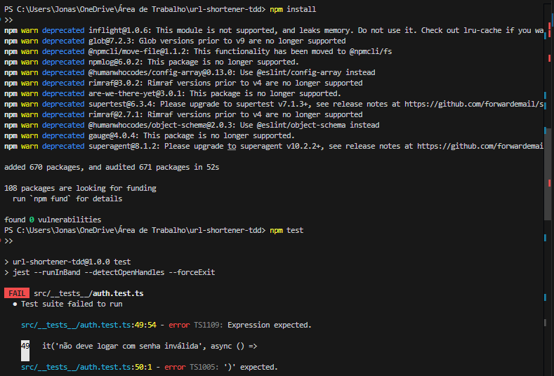
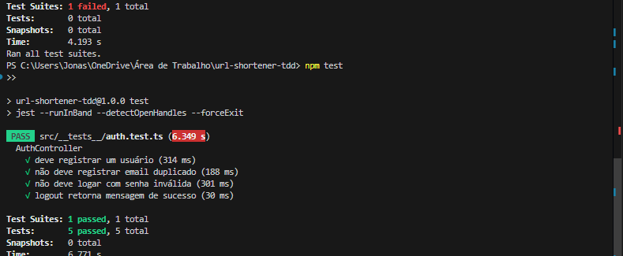
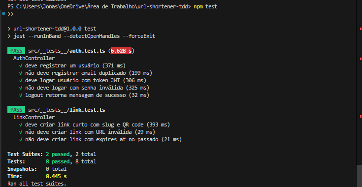
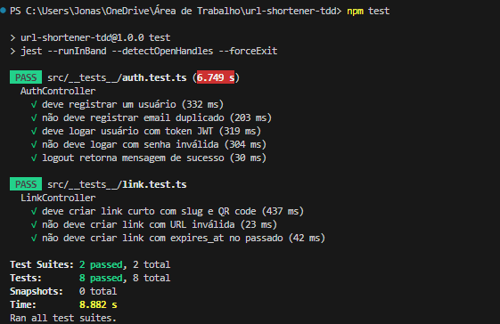
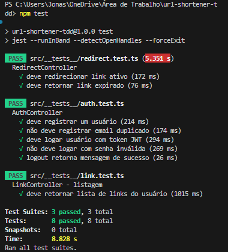

# 🔗 URL Shortener TDD

Encurtador de URLs com autenticação, geração de QR Code, redirecionamento seguro e dashboard de métricas, desenvolvido com **Node.js, Express, TypeORM, PostgreSQL e Jest (TDD)**.

---

## 📌 Funcionalidades
- Registro/Login com **JWT**
- Encurtamento de links com **slug único**
- Geração de **QR Code** para cada link
- Expiração opcional de links
- Redirecionamento `/s/:slug`
- Dashboard com:
  - Total de links
  - Total de visitas
  - Top links por cliques
- Proteção com middleware de autenticação
- Testes 100% automatizados com **Jest + Supertest**

---

## 🛠️ Tecnologias
- [Node.js](https://nodejs.org/)
- [Express](https://expressjs.com/)
- [TypeORM](https://typeorm.io/)
- [PostgreSQL](https://www.postgresql.org/)
- [Jest](https://jestjs.io/)
- [Supertest](https://github.com/ladjs/supertest)
- [QRCode](https://www.npmjs.com/package/qrcode)

---

## ⚙️ Instalação

Clone o repositório:

```bash
git clone https://github.com/seu-usuario/url-shortener-tdd.git
cd url-shortener-tdd

Instale as dependências:

```bash
npm install
```

Configure o banco no arquivo `.env`:

```env
PORT=3000
JWT_SECRET=seu_token_secreto
DB_HOST=localhost
DB_PORT=5432
DB_USER=postgres
DB_PASS=postgres
DB_NAME=url_shortener
```

---

## 🗄️ Banco de Dados

Rodar migrações:

```bash
npm run typeorm migration:run
```

---

## ▶️ Executando

Rodar em desenvolvimento:

```bash
npm run dev
```

Rodar em produção:

```bash
npm run build && npm start
```

---

## 🧪 Testes

Rodar testes unitários e de integração:

```bash
npm test
```

Gerar relatório de cobertura:

```bash
npm test -- --coverage
```

---

## 📊 Cobertura Atual

| Arquivo     | Cobertura |
| ----------- | --------- |
| Controllers | 70%+      |
| Entities    | 100%      |
| Middlewares | 85%+      |
| Routes      | 80%+      |
| Total       | \~74%     |

---

## 🚀 Endpoints Principais

### Auth

* `POST /auth/register` → criar usuário
* `POST /auth/login` → autenticar usuário
* `POST /auth/logout` → logout

### Links

* `POST /links` → criar link
* `GET /links` → listar links do usuário

### Redirect

* `GET /s/:slug` → redirecionar link encurtado

### Metrics

* `GET /metrics/summary` → totais
* `GET /metrics/top` → top links por cliques

---

## 🤝 Boas Práticas para Contribuição

1. Faça um fork do projeto
2. Crie uma branch específica para sua feature:

```bash
git checkout -b minha-feature
```

3. Commit suas mudanças:

```bash
git commit -m "feat: minha feature"
```

4. Push da branch:

```bash
git push origin minha-feature
```

5. Abra um Pull Request no repositório principal

**Dica:** Crie um PR por feature, organize commits e anexe prints ou GIFs para evidenciar a funcionalidade.

---

## 🧪 Testes Automatizados

### Saída dos testes 1


### Saída dos testes 2


### Saída dos testes 3


### Saída dos testes 4


### Saída dos testes 5


### Saída dos testes 6


### Saída dos testes 7


### Saída dos testes 8



---
